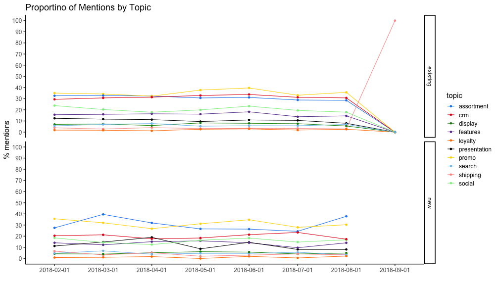
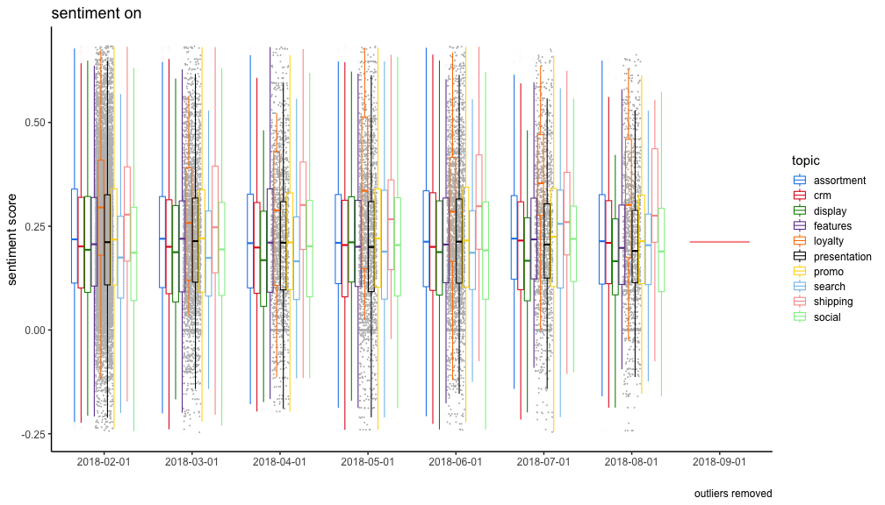

## About this version of the dashboard

* This dashboards presents the results of a online survye conducted by an US-american fashion online store.
* The survey is conducted continously and new data will be added over time.
* This version of the dashboard is specially build for the peer-graded Coursera assignment and does not allow users to upload new data. The final version of the dashboard, however, will allow users to upload new data sets.
* The data has been anynomized in order to protect the client and the customers.

---

## How to use this dashboard

* Users may select 2 different views on the data: 'Frequencies' and 'Sentiment'
* The 'Frequencies' answers the question how often have certain topics been mentioned.
* The 'Sentiment' gives you an idea of the sentiment per topic or overall. The higher the sentiment score the better the sentiment.
* Simply switch between the views using the tabs on top.
* Within the views you may pick the topic of choice and split it into customer types and/or add a time dimension (month) by using the drop down menues

---

## Example of a frequency plot

---

## Example of a sentiment plot

